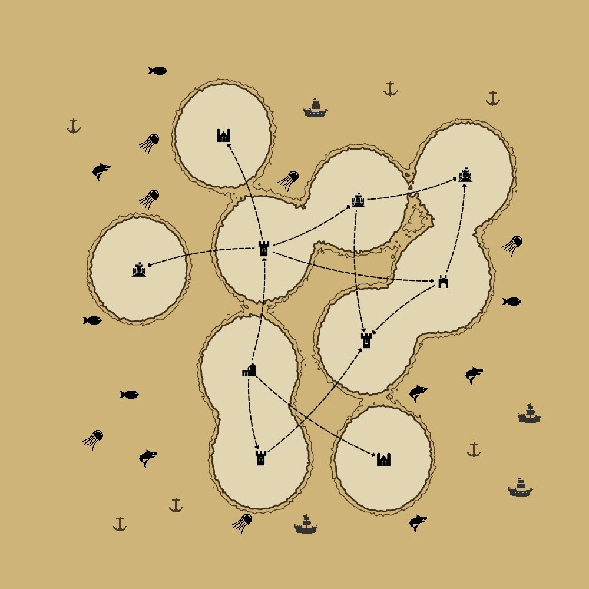

# ProceduralDungeonMaps

# Procedural Island Map Generator

This project generates a visually appealing procedural island map with realistic object placement and collision detection. It places land and sea props dynamically, ensuring no overlaps or collisions between objects.

## Features

- **Procedural Map Creation**: Generate an island with contours and Gaussian-filtered density grids for a natural appearance.
- **Dynamic Object Placement**:
  - Place land-based props (e.g., houses) at graph nodes.
  - Place sea-based props (e.g., ships, buoys) in available non-colliding locations.
- **Collision Detection**: Avoid overlapping props by calculating distances between object placements dynamically.
- **Layered Visualization**: 
  - Contours and gridlines for the island and sea.
  - Props dynamically placed on valid land and sea regions.
  - Dashed edges and labeled nodes for graph-based connections.

## How It Works

1. **Island and Contours**:
   - A Gaussian-filtered density grid defines the island's boundaries.
   - Contour levels distinguish land and sea regions.
2. **Land Prop Placement**:
   - Props are placed at graph node positions based on a layout.
   - Randomized selection from predefined prop images.
   - Collision-free placement with adjusted hitboxes.
3. **Sea Prop Placement**:
   - A grid search identifies valid points for sea props.
   - Props are placed while ensuring no collisions with land props or other sea props.

### Example Output

Below is an example of a generated island map with props placed correctly:



---

## Code Highlights

- **Land Props**: Placed at graph nodes using `nx.draw_networkx_nodes` and `AnnotationBbox`.
- **Sea Props**: Dynamically placed in available points determined by a grid search with collision thresholds.
- **Collision Detection**:
  - Distance-based calculation ensures no props overlap.
  - Updated lists dynamically remove invalid points after each placement.

## Usage

1. Clone the repository:
   ```bash
   git clone https://github.com/your-repo/procedural-island-map.git
